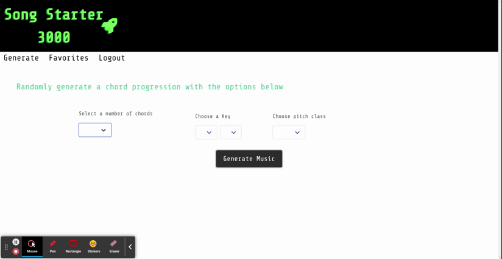

# Song Starter 3000
  

  

  ## Description
  This application is a song writing tool that creates chord progressions, will play samples of the chords, and allows users to save their favorite progressions. 

  ## Table of Contents
  * [Deployment](#deployment)
  * [Technologies](#technologies)
  * [Usage](#usage)
  * [Tests](#tests)
  * [Contributors](#contributors)  
  * [Future](#future)  
  * [License](#license)  
  
  ## Deployment
  The site is hosted by [Heroku](https://www.heroku.com), and uses [JawsDb](https://elements.heroku.com/addons/jawsdb) MySQL database.   
  [Click here to go to site](https://song-starter-3000.herokuapp.com/)
  ## Technologies
  - [bcrypt](https://www.npmjs.com/package/bcrypt)
  - [bulma](https://bulma.io/)
  - [connect-session-sequelize](https://www.npmjs.com/package/connect-session-sequelize)
  - [express-handlebars](https://www.npmjs.com/package/express-handlebars)
  - [express-session](https://www.npmjs.com/package/express-session)
  - [express.js](https://expressjs.com/)
  - [jest](https://jestjs.io/)
  - [mysql2](https://www.npmjs.com/package/mysql2)
  - [sequelize](https://sequelize.org/)
  - [tonaljs](https://github.com/tonaljs/tonal)  
  - [tonejs](https://tonejs.github.io/)  

  ## Usage
  Press the button to create a random chord progression, then click on the chords to hear how they sound. Or sign up to choose what key and how many chords you'd like in the progression. Users can optionally save the progression for future reference.  
   
  ## Tests
  [Jest](https://jestjs.io/) was used for testing.  
  `npm run test` to test the helper functions  
  ## Contributors
  - [michaelwwalker42](https://github.com/michaelwwalker42)  
  - [dmknapp2385](https://github.com/dmknapp2385) 

  ## Future 
Some features we'd like to add in the future:
 - More chord variety (sus chords, chord extensions, etc.)
 - Piano and guitar diagrams to demonstrate how to play chords
 - ability to create midi files from the chord progressions
 - option to randomly select a tempo
  ## License
  MIT License

Copyright (c) 2022 Michael Walker

Permission is hereby granted, free of charge, to any person obtaining a copy of this software and associated documentation files (the "Software"), to deal in the Software without restriction, including without limitation the rights to use, copy, modify, merge, publish, distribute, sublicense, and/or sell copies of the Software, and to permit persons to whom the Software is furnished to do so, subject to the following conditions:

The above copyright notice and this permission notice shall be included in all copies or substantial portions of the Software.

THE SOFTWARE IS PROVIDED "AS IS", WITHOUT WARRANTY OF ANY KIND, EXPRESS OR IMPLIED, INCLUDING BUT NOT LIMITED TO THE WARRANTIES OF MERCHANTABILITY, FITNESS FOR A PARTICULAR PURPOSE AND NONINFRINGEMENT. IN NO EVENT SHALL THE AUTHORS OR COPYRIGHT HOLDERS BE LIABLE FOR ANY CLAIM, DAMAGES OR OTHER LIABILITY, WHETHER IN AN ACTION OF CONTRACT, TORT OR OTHERWISE, ARISING FROM, OUT OF OR IN CONNECTION WITH THE SOFTWARE OR THE USE OR OTHER DEALINGS IN THE SOFTWARE. 
  
